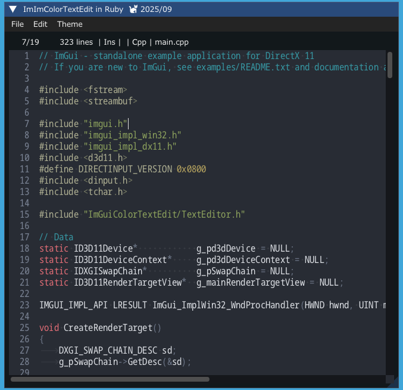

<!-- START doctoc generated TOC please keep comment here to allow auto update -->
<!-- DON'T EDIT THIS SECTION, INSTEAD RE-RUN doctoc TO UPDATE -->

- [IgRuby Examples](#igruby-examples)
  - [ImGui-Toggle / CImGui-Toggle](#imgui-toggle--cimgui-toggle)
  - [ImDrawList party](#imdrawlist-party)
  - [ImGui-Knobs / CImGui-Knobs](#imgui-knobs--cimgui-knobs)
  - [ImSpinner / CImSpinner](#imspinner--cimspinner)
  - [ImGuizmo / CImGuizmo](#imguizmo--cimguizmo)
  - [ImGuiColorTextEdit / cimCTE](#imguicolortextedit--cimcte)
  - [ImNodes / CImNodes](#imnodes--cimnodes)
  - [ImGuiFileDialog](#imguifiledialog)
  - [Iconfonts viewer](#iconfonts-viewer)
  - [Image loading](#image-loading)
  - [Show CJK fonts](#show-cjk-fonts)

<!-- END doctoc generated TOC please keep comment here to allow auto update -->


### IgRuby Examples

---

Ruby language + Dear ImGui + Additional libraries project

See [ruby-imgui-dev](https://github.com/dinau/ruby-imgui-dev) 

#### Prerequisites

---

✅ Windows10 or later  
- Install [RubyInstaller + **Devkit** ](https://rubyinstaller.org/downloads/) 3.4.6 or later  
  (Install Devkit (MSys2/MinGW))

🟥 ~~Linux OS~~


#### Donwload and running examples
---

1. Download `igruby_examples-1.9x.y.w.zip` from [Release page](https://github.com/dinau/igruby_examples/releases) and extract zip file.
1. Execute bundler command,

   ```sh
   cd  igruby_examples-1.9x.y.w 
   bundle install
   ```

   Note: Only supported under bundler enviroment at this moment 

1. Execute one of the example script,

   ```sh
   cd  glfw_opengl3
   r.bat              # or double click glfw_opengl3.rbw in Windows explorer
   ```


#### Snapshots

---


##### ImGui-Toggle / CImGui-Toggle

---

[ImGui-Toggle](https://github.com/cmdwtf/imgui_toggle) / [CImGui-Toggle](https://github.com/dinau/cimgui_toggle)

[glfw_opengl3_imtoggle.rb](https://github.com/dinau/igruby_examples/blob/main/glfw_opengl3_imtoggle/glfw_opengl3_imtoggle.rb)  

  

##### ImDrawList party 

---

Reference to [ImDrawList coding party - deadline Nov 30, 2020! #3606](https://github.com/ocornut/imgui/issues/3606)

[glfw_opengl3_imdrawlistparty.rb](https://github.com/dinau/igruby_examples/blob/main/glfw_opengl3_imdrawlistparty/imDrawListParty.rb)  

  

##### ImGui-Knobs / CImGui-Knobs

---

[ImGui-Knobs](https://github.com/altschuler/imgui-knobs) / [CImGui-Knobs](https://github.com/dinau/cimgui-knobs)

[glfw_opengl3_imknobs.rb](glfw_opengl3_imknobs/glfw_opengl3_imknobs.rb)

  

##### ImSpinner / CImSpinner

---

[ImSpinner](https://github.com/dalerank/imspinner) / [CImSpinner](https://github.com/dinau/cimspinner)

[glfw_opengl3_imspinner.rb](glfw_opengl3_imspinner/glfw_opengl3_imspinner.rb)  

Amazing !


##### ImGuizmo / CImGuizmo

---

[ImGuizmo](https://github.com/CedricGuillemet/ImGuizmo) / [CImGuizmo](https://github.com/cimgui/cimguizmo)

[glfw_opengl3_imguizmo.rb](glfw_opengl3_imguizmo/glfw_opengl3_imguizmo.rb)  


##### ImGuiColorTextEdit / cimCTE

---

[ImGuiColorTextEdit](https://github.com/santaclose/ImGuiColorTextEdit) / [cimCTE](https://github.com/cimgui/cimCTE) 

[glfw_opengl3_imcolortextedit.rb](https://github.com/dinau/igruby_examples/blob/main/glfw_opengl3_imcolortextedit/glfw_opengl3_imcolortextedit.rb)  



##### ImNodes / CImNodes

---

[ImNodes](https://github.com/Nelarius/imnodes) / [CImNodes](https://github.com/cimgui/cimnodes)

[glfw_opengl3_imnodes.rb](https://github.com/dinau/igruby_examples/blob/main/glfw_opengl3_imnodes/glfw_opengl3_imnodes.rb)  


##### ImGuiFileDialog 

---

[ImGuiFileDialog](https://github.com/aiekick/ImGuiFileDialog)

[glfw_opengl3_imguifiledialog.rb](https://github.com/dinau/igruby_examples/blob/main/glfw_opengl3_imguifiledialog/glfw_opengl3_imguifiledialog.rb)  


##### Iconfonts viewer

---

[glfw_opengl3_iconfont_viewer.rb](https://github.com/dinau/igruby_examples/blob/main/glfw_opengl3_iconfont_viewer/glfw_opengl3_iconfont_viewer.rb)


##### Image loading

---

[glfw_opengl3.rb](https://github.com/dinau/igruby_examples/blob/main/glfw_opengl3/glfw_opengl3.rb)

  

##### Showing CJK fonts

---

[glfw_opengl3_jp.rb](https://github.com/dinau/igruby_examples/blob/main/glfw_opengl3_jp/glfw_opengl3_jp.rb)


