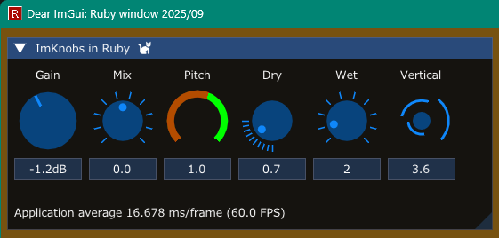
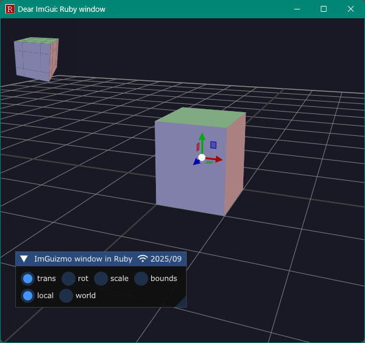
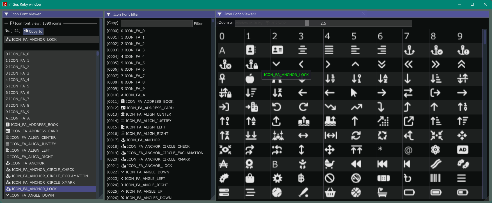

<!-- START doctoc generated TOC please keep comment here to allow auto update -->
<!-- DON'T EDIT THIS SECTION, INSTEAD RE-RUN doctoc TO UPDATE -->

- [IgRuby Examples](#igruby-examples)
  - [ImGui-Toggle / CImGui-Toggle](#imgui-toggle--cimgui-toggle)
  - [ImGui-Knobs / CImGui-Knobs](#imgui-knobs--cimgui-knobs)
  - [ImSpinner / CImSpinner](#imspinner--cimspinner)
  - [ImGuizmo / CImGuizmo](#imguizmo--cimguizmo)
  - [Iconfonts viewer](#iconfonts-viewer)
  - [Show image](#show-image)
  - [Show CJK fonts](#show-cjk-fonts)

<!-- END doctoc generated TOC please keep comment here to allow auto update -->


### IgRuby Examples

---

Ruby language + Dear ImGui + Extra libraries project

See [ruby-imgui-dev](https://github.com/dinau/ruby-imgui-dev) 

#### ImGui-Toggle / CImGui-Toggle

---

[ImGui-Toggle](https://github.com/cmdwtf/imgui_toggle) / [CImGui-Toggle](https://github.com/dinau/cimgui_toggle)

[glfw_opengl3_imtoggle.rb](https://github.com/dinau/igruby_examples/blob/main/glfw_opengl3_imtoggle/glfw_opengl3_imtoggle.rb)  

  

#### ImGui-Knobs / CImGui-Knobs

---

[ImGui-Knobs](https://github.com/altschuler/imgui-knobs) / [CImGui-Knobs](https://github.com/dinau/cimgui-knobs)

[glfw_opengl3_imknobs.rb](glfw_opengl3_imknobs/glfw_opengl3_imknobs.rb)

  

#### ImSpinner / CImSpinner

---

[ImSpinner](https://github.com/dalerank/imspinner) / [CImSpinner](https://github.com/dinau/cimspinner)

[glfw_opengl3_imspinner.rb](glfw_opengl3_imspinner/glfw_opengl3_imspinner.rb)  


#### ImGuizmo / CImGuizmo

---

[ImGuizmo](https://github.com/CedricGuillemet/ImGuizmo) / [CImGuizmo](https://github.com/cimgui/cimguizmo)

[glfw_opengl3_imguizmo.rb](glfw_opengl3_imguizmo/glfw_opengl3_imguizmo.rb)  



#### ImGuiColorTextEdit / cimCTE

---

[ImGuiColorTextEdit](https://github.com/santaclose/ImGuiColorTextEdit) / [cimCTE](https://github.com/cimgui/cimCTE) 

[glfw_opengl3_imcolortextedit.rb](https://github.com/dinau/igruby_examples/blob/main/glfw_opengl3_imcolortextedit/glfw_opengl3_imcolortextedit.rb)  


#### Iconfonts viewer

---

[glfw_opengl3_iconfont_viewer.rb](https://github.com/dinau/igruby_examples/blob/main/glfw_opengl3_iconfont_viewer/glfw_opengl3_iconfont_viewer.rb)




#### Show image

---

[glfw_opengl3.rb](https://github.com/dinau/igruby_examples/blob/main/glfw_opengl3/glfw_opengl3.rb)

  

#### Show CJK fonts

---

[glfw_opengl3_jp.rb](https://github.com/dinau/igruby_examples/blob/main/glfw_opengl3_jp/glfw_opengl3_jp.rb)


#### Memo

---

- Install sdl3 gem

   ```sh
   gem install specific_install
   gem specific_install https://github.com/vaiorabbit/sdl3-bindings
   ```
