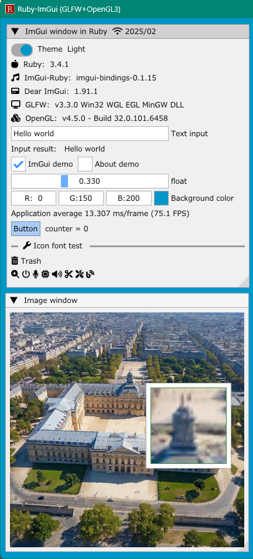
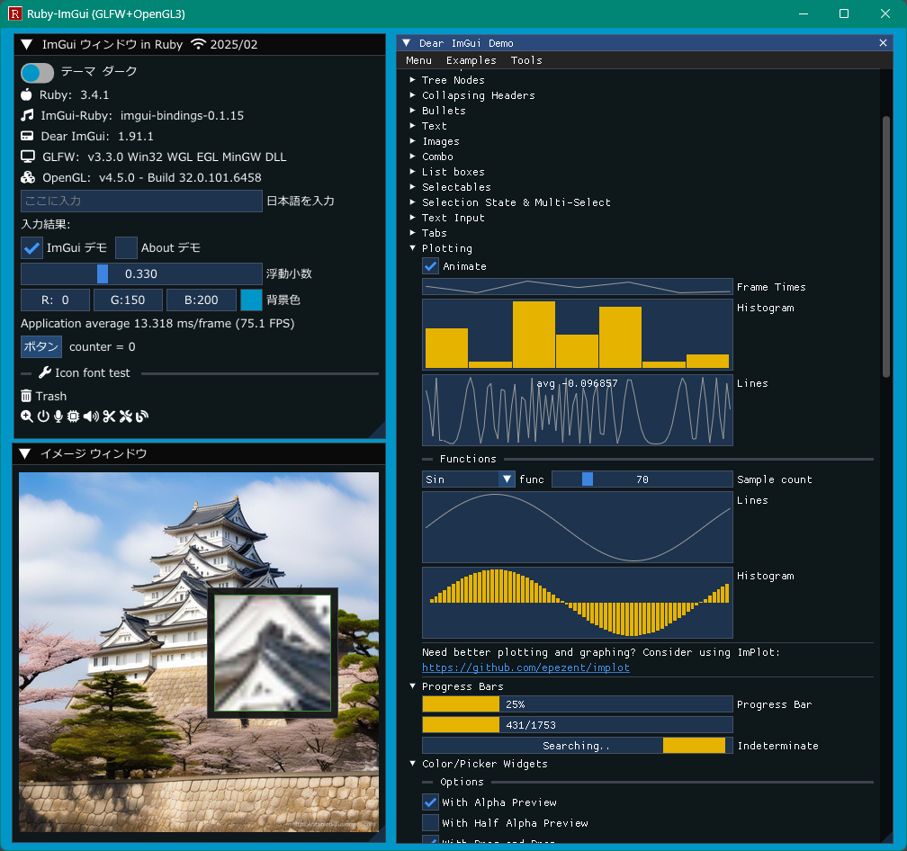
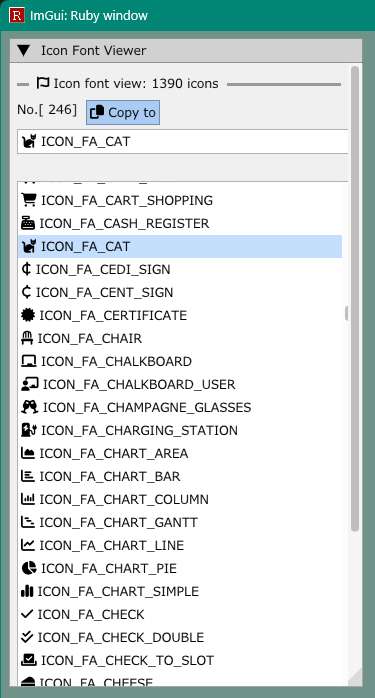

<!-- START doctoc generated TOC please keep comment here to allow auto update -->
<!-- DON'T EDIT THIS SECTION, INSTEAD RE-RUN doctoc TO UPDATE -->

- [IgRuby_Examples](#igruby_examples)
  - [Prerequisites](#prerequisites)
  - [Install Ruby gems](#install-ruby-gems)
  - [Install dlls on Windows OS](#install-dlls-on-windows-os)
  - [Screenshots](#screenshots)
    - [glfw_opengl3](#glfw_opengl3)
    - [glfw_opengl3_jp](#glfw_opengl3_jp)
    - [glfw_opengl3_iconfont_viewer](#glfw_opengl3_iconfont_viewer)
  - [Generating single EXE file on Windows OS with Aibika](#generating-single-exe-file-on-windows-os-with-aibika)
  - [My tools version](#my-tools-version)
  - [Other projects](#other-projects)
  - [Similar project ImGui / CImGui](#similar-project-imgui--cimgui)
  - [SDL Game tutorial Platfromer](#sdl-game-tutorial-platfromer)

<!-- END doctoc generated TOC please keep comment here to allow auto update -->

## IgRuby_Examples

---

[Ruby-Imgui](https://github.com/vaiorabbit/ruby-imgui) is the wrapper library to use awesome GUI library [Dear ImGui](https://github.com/ocornut/imgui).


This project has some basic examples using [Ruby-Imgui](https://github.com/vaiorabbit/ruby-imgui) library.

ImGui / CImGui 1.91.8 (2025/03)

### Prerequisites

---

- [x] WindowsOS 10 or later
- [ ] LinuxOS : N/A (Im not familiar with Ruby on Linux OS)
- Use Ruby 3.4.5 or later : https://rubyinstaller.org/downloads/  
OK: with or without Devkit 

### Install Ruby gems

---

Note: As of now, specify imgui-bindings version `0.1.17` 

```sh
gem install imgui-bindings:0.1.17 sdl2-bindings stbimage aibika rake
```

### Install dlls on Windows OS

---

```sh
git clone https://github.com/dinau/igruby_examples
cd igruby_examples
copy dlls_extra\*.dll c:\Ruby34-x64\bin\       # Specify your Ruby bin folder 
```

### Screenshots

------

#### glfw_opengl3

---

[glfw_opengl3](https://github.com/dinau/igruby_examples/blob/main/glfw_opengl3/glfw_opengl3.rb)

- [x] Image loading
- [x] Magnifying glass

```sh
pwd 
igruby_examples
cd glfw_opengl3
ruby glfw_opengl3.rb    # Or double click glfw_opengl3.rbw in file explorer
```



#### glfw_opengl3_jp

---

[glfw_opengl3_jp](https://github.com/dinau/igruby_examples/blob/main/glfw_opengl3_jp/glfw_opengl3_jp.rb)

- [x] Image loading
- [x] Magnifying glass

```sh
pwd 
igruby_examples
cd glfw_opengl3_jp
ruby glfw_opengl3_jp.rb    # Or double click glfw_opengl3_jp.rbw in file explorer
```



#### glfw_opengl3_iconfont_viewer

---

[glfw_opengl3_iconfont_viewer](https://github.com/dinau/igruby_examples/blob/main/glfw_opengl3_iconfont_viewer/glfw_opengl3_iconfont_viewer.rb)

- [x] Icon fonts viewer
- [x] Incremental search

```sh
pwd 
igruby_examples
cd glfw_opengl3_iconfont_viewer
ruby glfw_opengl3_iconfont_viewer.rb    # Or double click glfw_opengl3_iconfont_viewer.rbw in file explorer
```



### Generating single EXE file on Windows OS with Aibika

---

Generating single EXE file on Windows OS with [Aibika](https://github.com/tamatebako/aibika)

For instance,

```sh
pwd 
igruby_examples
cd glfw_opengl3
make 
```

That's all !  
`glfw_opengl3.exe` will be generated in current folder.

### My tools version

---

- Ruby 3.4.5 (2025-07-16 revision 20cda200d3) +PRISM [x64-mingw-ucrt] **without Devkit**
- Gcc.exe (Rev2, Built by MSYS2 project) 15.2.0

### Other projects 

---

- Using Ruby-ImGui project
   - https://github.com/vaiorabbit/blend2d-bindings

### Similar project ImGui / CImGui

---

| Language             |          | Project                                                                                                                                         |
| -------------------: | :---:    | :----------------------------------------------------------------:                                                                              |
| **Nim**              | Compiler | [ImGuin](https://github.com/dinau/imguin), [Nimgl_test](https://github.com/dinau/nimgl_test), [Nim_implot](https://github.com/dinau/nim_implot) |
| **Lua**              | Script   | [LuaJITImGui](https://github.com/dinau/luajitImGui)                                                                                             |
| **Zig**, C lang.     | Compiler | [Dear_Bindings_Build](https://github.com/dinau/dear_bindings_build)                                                                             |
| **Zig**              | Compiler | [ImGuinZ](https://github.com/dinau/imguinz)                                                                                                     |
| **NeLua**            | Compiler | [NeLuaImGui](https://github.com/dinau/neluaImGui) / [NeLuaImGui2](https://github.com/dinau/neluaImGui2)                                         |
| **Python**           | Script   | [DearPyGui for 32bit WindowsOS Binary](https://github.com/dinau/DearPyGui32/tree/win32)                                                         |

### SDL Game tutorial Platfromer

---


| Language             |          | Project                                                                                                  |
| -------------------: | :---:    | :----------------------------------------------------------------:                                       |
| **Nim**              | Compiler | [Nim-Platformer](https://github.com/dinau/nim-platformer)/ [sdl3_nim](https://github.com/dinau/sdl3_nim) |
| **LuaJIT**           | Script   | [LuaJIT-Platformer](https://github.com/dinau/luajit-platformer)                                          |
| **Nelua**            | Compiler | [NeLua-Platformer](https://github.com/dinau/nelua-platformer)                                            |
| **Zig**              | Compiler | [Zig-Platformer](https://github.com/dinau/zig-platformer)                                                |
